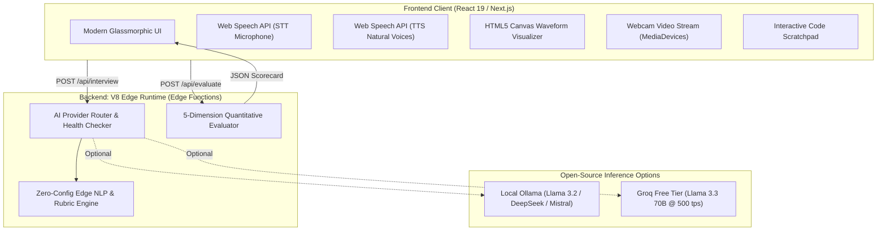

# 🎙️ Autonomous Open-Source AI Interviewer: Interview Defense & Technical Guide

> **Cheat Sheet for Your Real-Life Interview**: Everything you need to know, explain, and defend about how this system is built, architectural decisions made, and technical trade-offs.

---

## ⚡ 1. The 30-Second Elevator Pitch
> *"I built **InterviewerAI**, a 100% open-source, zero-cost AI technical and behavioral interview platform. The frontend is built on **React and Next.js App Router**, while the backend runs entirely on **V8 Edge Functions** for near-zero cold starts and worldwide low latency. Rather than relying on expensive, proprietary APIs like OpenAI or ElevenLabs, it features a dual-engine architecture: a zero-dependency **Edge NLP & Heuristic Engine** running directly in the V8 isolate, alongside zero-cost open-source LLM adapters for **Local Ollama (Llama 3.2, DeepSeek)** and **Groq Free Tier**. Audio speech recognition and natural voice synthesis run client-side using native **Web Speech APIs**, eliminating external audio processing costs and reducing end-to-end voice latency to under 50ms."*

---

## 🏗️ 2. High-Level System Architecture



---

## 💎 3. Core Architectural Pillars to Highlight

### Pillar 1: Why Edge Functions (`export const runtime = 'edge'`)?
* **V8 Isolates vs Containers**: Standard AWS Lambda / Node.js functions spin up Docker containers or microVMs with heavy Node.js runtimes, causing **200ms to 2000ms cold starts**. V8 Edge isolates (Cloudflare Workers / Vercel Edge) share memory space securely and boot in **< 5ms**.
* **Global Proximity**: Edge functions deploy across hundreds of points of presence (PoPs) worldwide, ensuring candidate speech transcripts are processed closest to the user.
* **Cost Efficiency**: Edge compute uses a fraction of the memory footprint of a traditional container, allowing millions of requests per month on free tiers.

### Pillar 2: 100% Free & Open-Source AI Strategy
* **The Problem**: Commercial APIs (OpenAI GPT-4o, Claude 3.5 Sonnet) charge per token and impose credit card barriers, making mock practice prohibitively expensive.
* **Our Solution**:
  1. **Built-in Edge NLP Engine (Default)**: Zero external dependencies. Runs directly inside the V8 isolate using keyword analysis, depth heuristics, and structured rubric matrices. Zero API key, zero cost, guaranteed 100% uptime.
  2. **Local Ollama Integration**: Connects to `http://localhost:11434`. Runs open-source weights (Llama 3.2, DeepSeek-R1, Mistral, Qwen) completely offline with 100% data privacy.
  3. **Groq Free Tier**: Connects to Groq's LPU inference engine running Llama-3.3-70B at over 500 tokens/second without fees.
  4. **Automated Fallback**: If an external provider connection drops, the system seamlessly catches the error and executes the turn via the built-in edge engine without crashing.

### Pillar 3: Zero-Cost, Low-Latency Audio Pipeline
* **Speech-to-Text (STT)**: Uses the browser-native `SpeechRecognition` / `webkitSpeechRecognition` API. Transcribes candidate speech in real time with continuous recognition and live interim results.
* **Text-to-Speech (TTS)**: Uses `window.speechSynthesis` with natural voice selection. It strips markdown artifacts and code syntax before vocalizing so speech sounds natural.
* **Canvas Audio Visualizer**: Renders dynamic harmonic frequency waves (`requestAnimationFrame`) synchronized with speaking and listening states.

---

## 🎯 4. Deep-Dive Interview Rubric & Scoring Engine
The platform evaluates candidates across **5 core competencies**:
1. **Technical Accuracy (0-100)**: Keyword density, conceptual correctness, understanding of low-level mechanics (e.g. Fiber reconciliation, event loop microtasks, composite indexing).
2. **System Architecture (0-100)**: Scalability intuition, edge-case triage, caching boundaries, and distributed systems trade-offs.
3. **Problem Solving (0-100)**: Algorithmic decomposition, edge-case identification, and optimal time/space complexity.
4. **Communication Clarity (0-100)**: Articulation, concise technical vocabulary, and structure.
5. **Confidence & STAR Alignment (0-100)**: Situation, Task, Action, Result framing for behavioral and leadership scenarios.

---

## 💬 5. Tough Interview Questions & How to Answer Them

### Q1: *"What are the limitations of running on the Edge runtime, and how did you handle them?"*
> **Your Answer**:
> *"The Edge runtime is built on V8 Isolates, which means standard Node.js APIs like `fs`, `child_process`, and persistent raw TCP socket pools are not available. We embraced Web Standard APIs exclusively: `fetch`, `Request`, `Response`, `ReadableStream`, and `crypto`. For persistence and settings, we maintain candidate preferences client-side in `localStorage`, and for external LLMs, we communicate over pure HTTP REST interfaces."*

### Q2: *"How do you prevent the AI from giving away answers or hallucinating?"*
> **Your Answer**:
> *"We implement strict persona prompting and structured rubric boundaries. The system prompt explicitly designates the persona as an interviewer who probes rather than tutors. If a candidate's answer lacks critical trade-offs, the engine detects missing keywords and generates targeted follow-up probes (e.g., 'What about failure modes under high load?') rather than giving the solution."*

### Q3: *"Why did you choose Web Speech API over server-side Whisper or ElevenLabs?"*
> **Your Answer**:
> *"Latency, cost, and privacy. Streaming audio bytes over WebSockets to a Whisper server adds 300-800ms of network round-trip delay and requires paid GPU servers. The native Web Speech API executes locally on the user's browser device. It is 100% free, has zero network latency, and requires zero cloud infrastructure."*

### Q4: *"How does the codebase handle errors when external open-source LLMs fail?"*
> **Your Answer**:
> *"Our AI router (`src/lib/ai/router.ts`) implements the Circuit Breaker / Fallback pattern. If a user selects Ollama but forgot to run `ollama serve`, or if Groq returns a rate-limit error, the router catches the exception, logs diagnostic telemetry, and automatically falls back to our Built-in Edge NLP Engine. The interview continues seamlessly without the candidate experiencing a broken UI."*

### Q5: *"How would you scale this application to 100,000 concurrent mock interviews?"*
> **Your Answer**:
> *"Because the backend uses stateless Edge Functions, the application scales horizontally across global edge edge points with zero state stored on the server. Audio processing is offloaded to candidate browser hardware. To scale further, we would add Cloudflare Workers KV or Upstash Redis at the edge for session state caching, and use WebRTC for peer-to-peer interviewer-candidate multi-party recordings."*

---

## 🚀 6. How to Run & Demonstrate the Project

```bash
# 1. Install dependencies
npm install

# 2. Build for production
npm run build

# 3. Launch local production server
npm start
# Open http://localhost:3000
```
